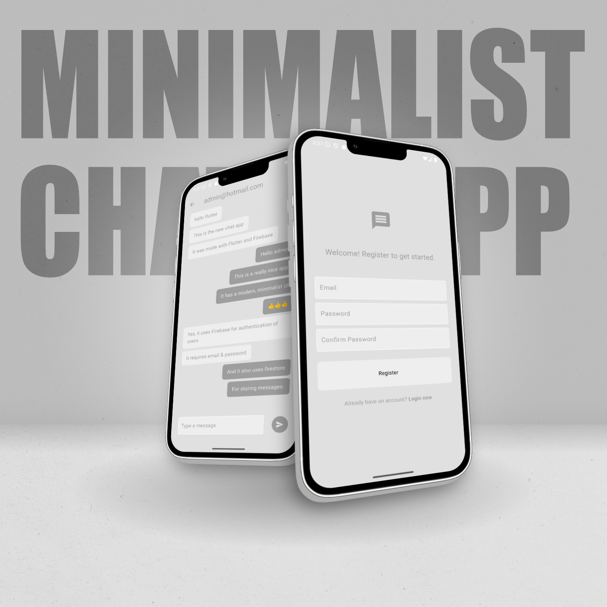
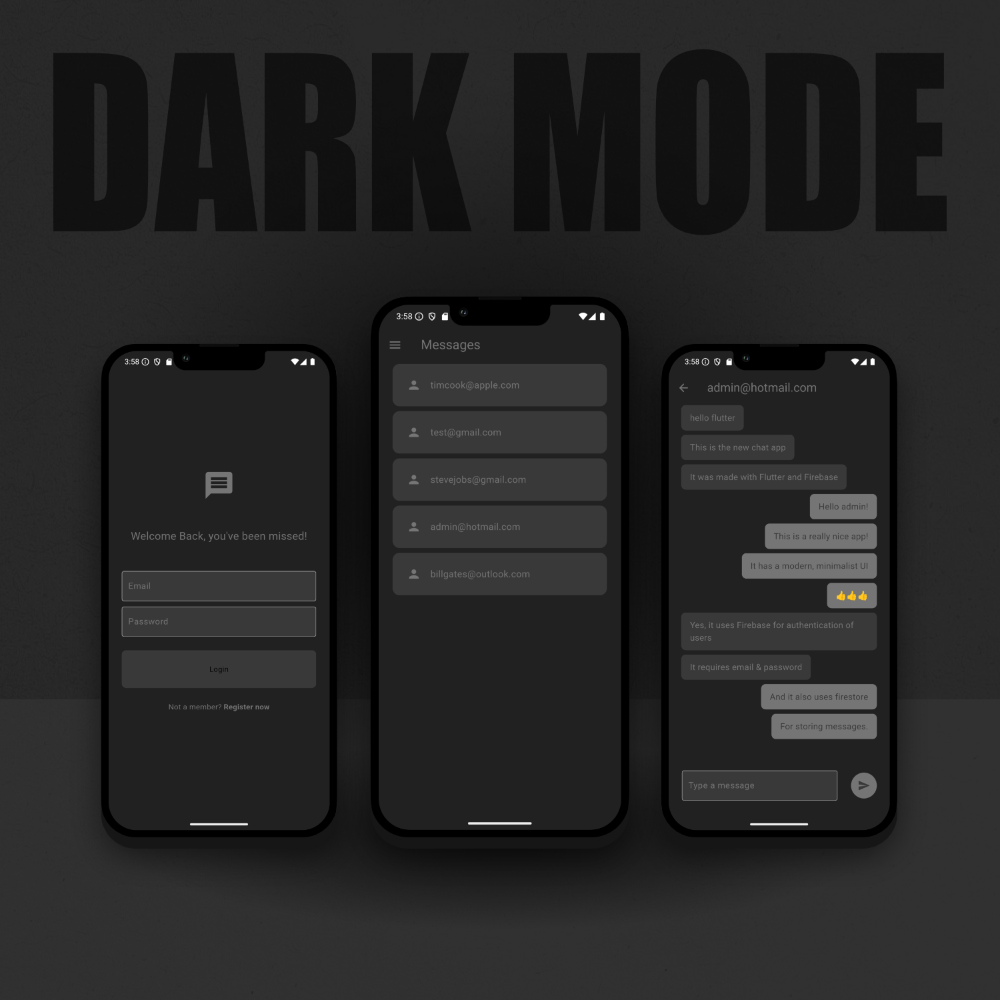
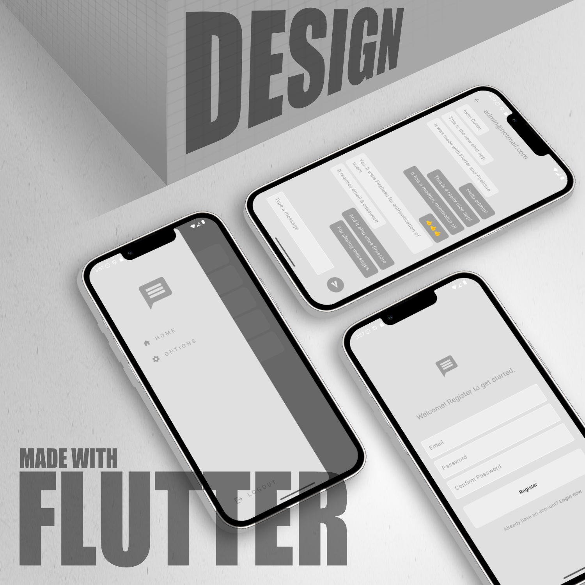

# Minimalist Chat App

A minimalist chat app made with Flutter and Firebase. 

## 📱 About the App

The app features modern UI with the ability to switch between light and dark mode.
Firebase is used for authentication, and Firestore database is used for storing messages.
Users can create accounts and login, and they can send messages to one-another.

 

## 💻 Screenshots

|  |  |
| :----------------------------------------------------------------: | :-------------------------------------------------------------------: |
|  |

## ℹ️ Flutter Resources

- [Lab: Write your first Flutter app](https://docs.flutter.dev/get-started/codelab)
- [Cookbook: Useful Flutter samples](https://docs.flutter.dev/cookbook)

For help getting started with Flutter development, view the
[online documentation](https://docs.flutter.dev/), which offers tutorials,
samples, guidance on mobile development, and a full API reference.
